<div align="center">



</div>


## `> OPS_CENTER.live`

<div align="center">


</div>


## `> WHO_AM_I.exe`

<div align="center">


</div>

<details>
<summary><code>&gt; VIEW_RAW_RECORD</code></summary>

```yaml
name: Amirhesam
role: Automation Software Engineer // SDET
hq: Tech City, Sector 7
focus:
  - UI Automation
  - API Automation
  - Database Testing
  - CI/CD
  - Automation Frameworks
  - Web & App Development
current_stack:
  - Java
  - Selenium
  - Cucumber BDD
  - JUnit
  - REST Assured
  - SQL
  - Jenkins
  - Jira
hobbies:
  - 🎸 Music
  - 🎮 Gaming
  - 📸 Photography
status: "Always Learning..."
```

</details>


## `> TECH_CITY_DEPARTMENTS.sh`

<div align="center">


</div>

| `DEPARTMENT` | `WHAT WE BUILD` | `STATUS` |
|:--|:--|:--|
| 🌐 **Web Studio** | Landing pages, portfolios, business sites, responsive and fast | `🟢 ONLINE` |
| 💻 **Web App Lab** | Dashboards, tools, admin panels, full-stack apps with APIs and databases | `🟢 ONLINE` |
| 📱 **Mobile App Lab** | Cross-platform apps for Android and iOS | `🟢 ONLINE` |
| 🧪 **QA Automation Division** | Test frameworks, scripts, bots, CI/CD pipelines | `🟢 ONLINE` |

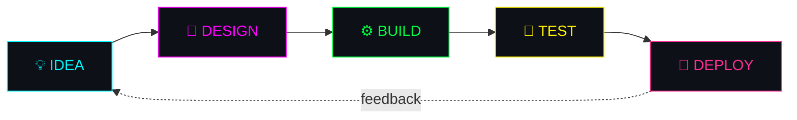


> 💬 *Need a website or app? Reach out below and let's build something.*


## `> LOAD_TECH_ARSENAL.sh`























## `> SYSTEM_ANALYTICS.exe`

<div align="center">


</div>


## `> PERSONAL_MODULES`

```text
[ MUSIC MODULE ]       ██████████ ONLINE  🎸
[ GAMING MODULE ]      ██████████ ONLINE  🎮
[ PHOTOGRAPHY ]        ██████████ ONLINE  📸
[ AUTOMATION ]         ██████████ ONLINE  ⚙️
[ APP & WEB BUILDER ]  ██████████ ONLINE  🌐
[ LEARNING ]           ██████████ ACTIVE  🧠
```

## `> RANDOM_TRANSMISSION`

<div align="center">


</div>


## `> OPEN_COMM_CHANNEL`

<div align="center">

[](https://amirhesamtech.com)
[](https://github.com/amirh3sam)
[](https://www.tiktok.com/@techwithamirh3sam)


</div>

```text
┌──────────────────────────────────────────────────────────────┐
│                                                              │
│     SYSTEM STATUS  : ONLINE                                  │
│     CURRENT MODE   : BUILD // TEST // AUTOMATE               │
│     NEXT OBJECTIVE : KEEP LEARNING                           │
│                                                              │
└──────────────────────────────────────────────────────────────┘
```

<div align="center">


</div>
