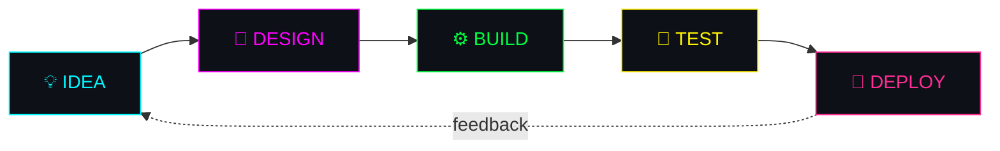

<div align="center">


</div>

---

## `> WHO_AM_I.exe`

```yaml
name: Amirhesam
role: Automation Software Engineer // SDET
district: Neon City, Sector 7
focus:
  - UI Automation
  - API Automation
  - Database Testing
  - CI/CD
  - Automation Frameworks
  - Web & App Development
current_stack:
  - Java
  - Selenium
  - Cucumber BDD
  - JUnit
  - REST Assured
  - SQL
  - Jenkins
  - Jira
hobbies:
  - 🎸 Music
  - 🎮 Gaming
  - 📸 Photography
status: "Always Learning..."
```

---

## `> BUILD_APPS_AND_WEBSITES.sh`

<div align="center">


</div>

| `MODULE` | `WHAT I BUILD` | `STATUS` |
|:--|:--|:--|
| 🌐 **Websites** | Landing pages, portfolios, business sites, responsive and fast | `🟢 ONLINE` |
| 💻 **Web Apps** | Dashboards, tools, admin panels, full-stack apps with APIs and databases | `🟢 ONLINE` |
| 📱 **Mobile Apps** | Cross-platform apps for Android and iOS | `🟢 ONLINE` |
| 🤖 **Automation Tools** | Test frameworks, scripts, bots, CI/CD pipelines | `🟢 ONLINE` |



**Build toolkit**


> 💬 *Need a website or app? Reach out below and let's build something.*

---

## `> LOAD_TECH_ARSENAL.sh`

### `01 // PROGRAMMING + WEB`


### `02 // AUTOMATION_CORE`


### `03 // API_INTERFACE`


### `04 // DATABASE_NETWORK`


### `05 // CI_CD_PIPELINE`


### `06 // PROJECT_CONTROL`


### `07 // CLOUD_NETWORK`


### `08 // DEVELOPMENT_ENVIRONMENT`


### `09 // VERSION_CONTROL`


### `10 // SYSTEM_TOOLS`


### `11 // VISUAL_SYSTEM`


---

## `> SYSTEM_ANALYTICS.exe`

<div align="center">


</div>

---

## `> PERSONAL_MODULES`

```text
[ MUSIC MODULE ]       ██████████ ONLINE  🎸
[ GAMING MODULE ]      ██████████ ONLINE  🎮
[ PHOTOGRAPHY ]        ██████████ ONLINE  📸
[ AUTOMATION ]         ██████████ ONLINE  ⚙️
[ APP & WEB BUILDER ]  ██████████ ONLINE  🌐
[ LEARNING ]           ██████████ ACTIVE  🧠
```

---

## `> RANDOM_TRANSMISSION`

<div align="center">


</div>

---

## `> OPEN_COMM_CHANNEL`

<div align="center">

<!-- Replace the links below with your own -->
[](https://github.com/amirh3sam)
[](https://www.linkedin.com/in/YOUR-LINKEDIN)
[](mailto:YOUR-EMAIL@example.com)


</div>

---

```text
┌──────────────────────────────────────────────────────────────┐
│                                                              │
│     SYSTEM STATUS  : ONLINE                                  │
│     CURRENT MODE   : BUILD // TEST // AUTOMATE               │
│     NEXT OBJECTIVE : KEEP LEARNING                           │
│                                                              │
└──────────────────────────────────────────────────────────────┘
```

<div align="center">


</div>
