<div align="center">




</div>


## `> EXPLORE_AMIRHESAMTECH.com`

<a href="https://amirhesamtech.com/">
  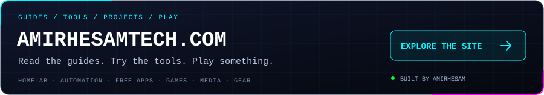
</a>

Explore my practical tech guides, free browser apps, games and projects on [**amirhesamtech.com**](https://amirhesamtech.com/).

<table width="100%">
<tr>
<td width="33%" valign="top"><a href="https://amirhesamtech.com/guides/"><b>📚 Guides &amp; Tutorials ↗</b></a><br><sub>Homelab, Linux, test automation and AI tutorials.</sub></td>
<td width="33%" valign="top"><a href="https://amirhesamtech.com/apps/"><b>🧰 Free Apps ↗</b></a><br><sub>Browser tools for tracking, planning and calculations.</sub></td>
<td width="33%" valign="top"><a href="https://amirhesamtech.com/games/"><b>🎮 Games ↗</b></a><br><sub>Snake, 2048, Breakout and more. Play in your browser.</sub></td>
</tr>
<tr>
<td width="33%" valign="top"><a href="https://amirhesamtech.com/media-lab/"><b>🎬 Media Lab ↗</b></a><br><sub>Short tech videos, demos and automation ideas.</sub></td>
<td width="33%" valign="top"><a href="https://amirhesamtech.com/tech-hub/"><b>⚡ Tech Deal Hub ↗</b></a><br><sub>Desk, homelab and everyday tech picks.</sub></td>
<td width="33%" valign="top"><a href="https://amirhesamtech.com/playbook/"><b>📖 PlayBook ↗</b></a><br><sub>Money Guild AI: a blog automation guide and toolkit.</sub></td>
</tr>
</table>


## `> OPS_CENTER.live`

<div align="center">

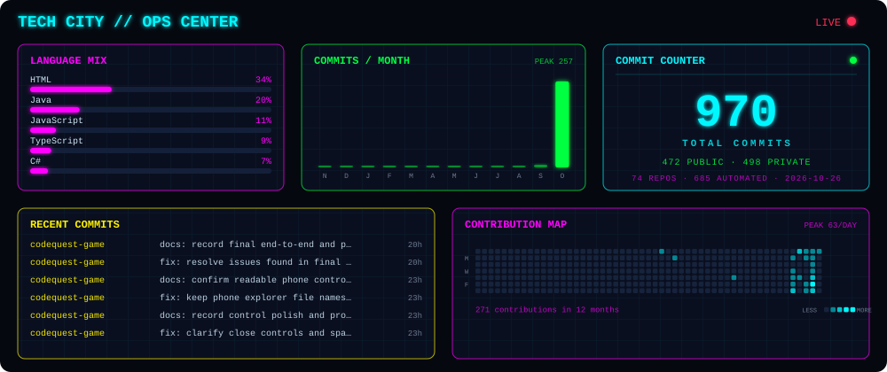

</div>


## `> WHO_AM_I.exe`

<div align="center">



</div>

<details>
<summary><code>&gt; VIEW_RAW_RECORD</code></summary>

```yaml
name: Amirhesam
role: Automation Software Engineer // SDET
hq: Tech City, Sector 7
focus:
  - UI Automation
  - API Automation
  - Database Testing
  - CI/CD
  - Automation Frameworks
  - Web & App Development
current_stack:
  - Java
  - Selenium
  - Cucumber BDD
  - JUnit
  - REST Assured
  - SQL
  - Jenkins
  - Jira
hobbies:
  - 🎸 Music
  - 🎮 Gaming
  - 📸 Photography
status: "Always Learning..."
```

</details>


## `> WHAT_I_BUILD`

| | |
|:--|:--|
| 🌐 **Websites** | Landing pages, portfolios and business sites |
| 💻 **Web apps** | Dashboards, admin panels, full-stack apps with APIs and databases |
| 📱 **Mobile apps** | Cross-platform, Android and iOS |
| 🧪 **Test automation** | Frameworks, scripts, bots and CI/CD pipelines |

Designed, built, tested, deployed. Got an idea? [Let's build it.](https://amirhesamtech.com)


## `> APP_SHOWCASE.app`

Apps built end to end: designed, built, tested, shipped.

**[Daily Hub](https://daily-hub-one-zeta.vercel.app)** &nbsp;·&nbsp; <sub>habits, money, meals, family life and sleep in one private app. English and Persian, data stays on your device</sub><br>
<sub><a href="https://daily-hub-one-zeta.vercel.app">Open the app</a> &nbsp;·&nbsp; <a href="https://github.com/amirh3sam/lifeHubDailyMartix">Source code</a></sub>

<table align="center">
<tr>
<td align="center" width="25%"><a href="https://daily-hub-one-zeta.vercel.app">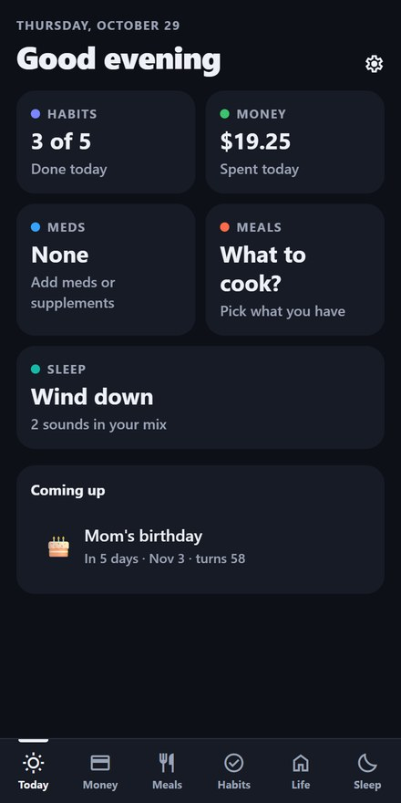</a><br><sub><b>Today</b><br>the day at a glance</sub></td>
<td align="center" width="25%"><a href="https://daily-hub-one-zeta.vercel.app/habits">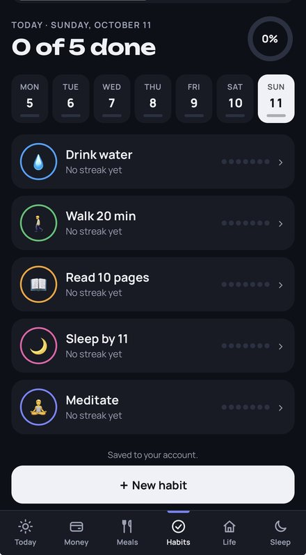</a><br><sub><b>Habits</b><br>streaks and a week strip</sub></td>
<td align="center" width="25%"><a href="https://daily-hub-one-zeta.vercel.app/meals">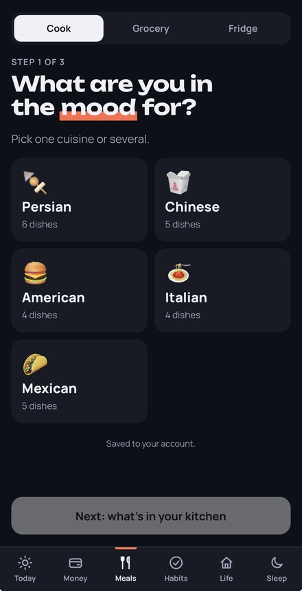</a><br><sub><b>Meals</b><br>cook, grocery, fridge</sub></td>
<td align="center" width="25%"><a href="https://daily-hub-one-zeta.vercel.app/sleep">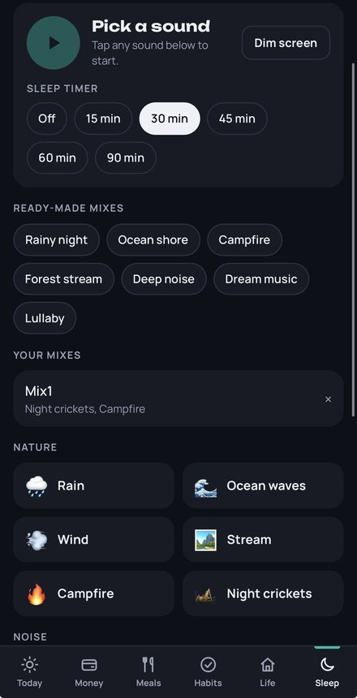</a><br><sub><b>Sleep</b><br>mixable sounds, timer</sub></td>
</tr>
</table>

**Scientific Calculator** &nbsp;·&nbsp; <sub>full function set with a graphing mode</sub>

<table align="center">
<tr>
<td align="center" colspan="2">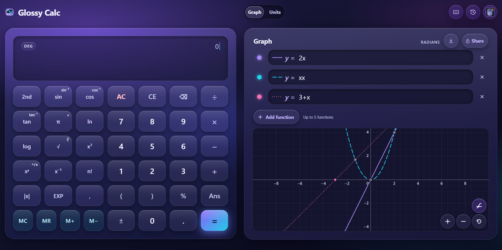<br><sub><b>Glossy Calculator</b><br>scientific functions and graphing side by side</sub></td>
</tr>
<tr>
<td align="center" width="50%">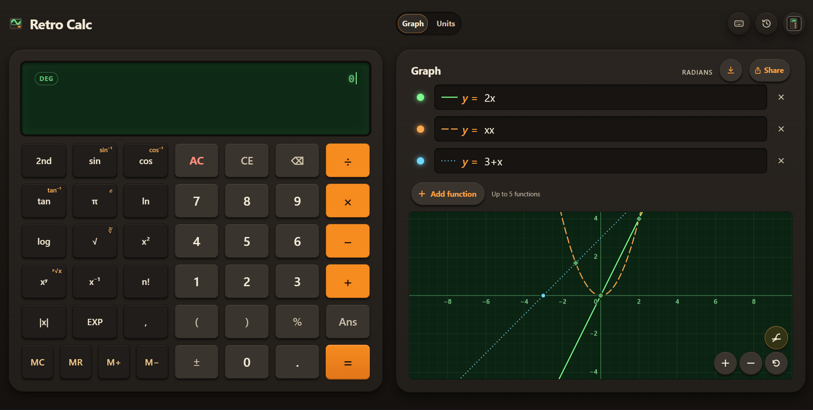<br><sub><b>Retro Calculator</b><br>trig, logs, memory, history</sub></td>
<td align="center" width="50%">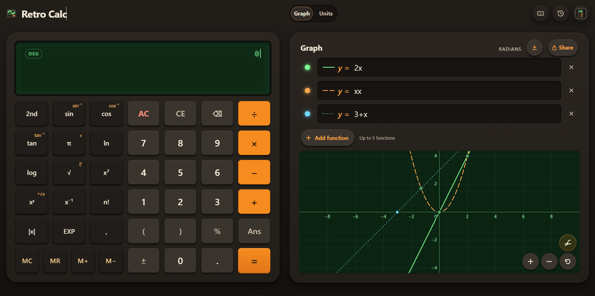<br><sub><b>Graph</b><br>up to five functions, roots and intersections</sub></td>
</tr>
<tr>
<td align="center" width="50%">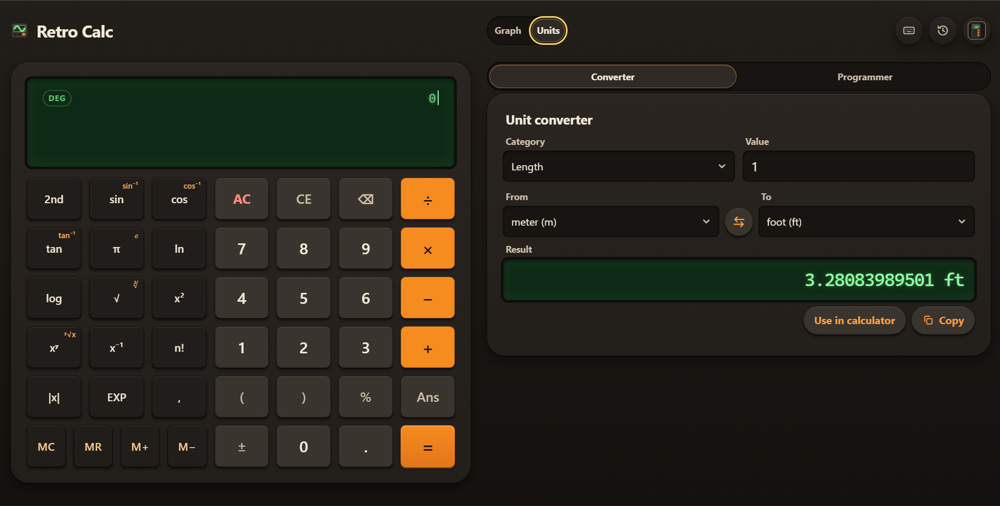<br><sub><b>Unit Converter</b><br>convert units and use the result in the calculator</sub></td>
<td align="center" width="50%">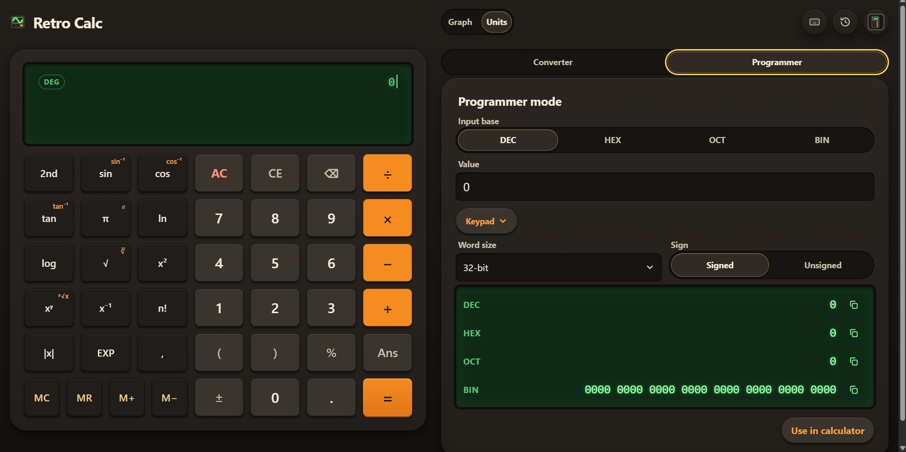<br><sub><b>Programmer Mode</b><br>DEC, HEX, OCT and BIN</sub></td>
</tr>
</table>

**[CodeQuest](https://codequest-game-inky.vercel.app/)** &nbsp;|&nbsp; <sub>learn Java, JavaScript, TypeScript or Python through a guided city adventure: rescue robots, write real code, build playable games and earn your own developer room</sub>

<table align="center" width="100%">
<tr>
<td align="center" width="50%"><a href="https://codequest-game-inky.vercel.app/"></a><br><sub><b>One clear adventure path</b><br>begin with no coding experience and follow the next step</sub></td>
<td align="center" width="50%"><a href="https://codequest-game-inky.vercel.app/">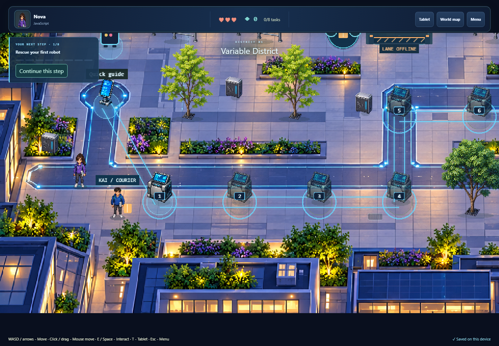</a><br><sub><b>Explore a living tech city</b><br>23 districts, coding missions, robots and arcade breaks</sub></td>
</tr>
<tr>
<td align="center" width="50%"><a href="https://codequest-game-inky.vercel.app/">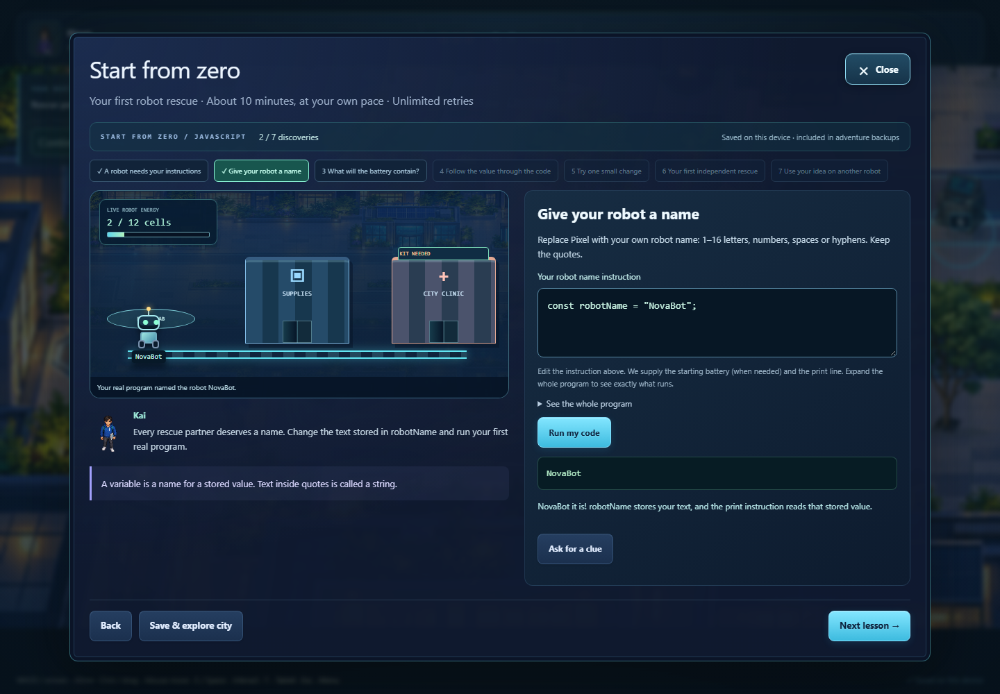</a><br><sub><b>Learn by rescuing a robot</b><br>predict, experiment, ask for clues and run real code</sub></td>
<td align="center" width="50%"><a href="https://codequest-game-inky.vercel.app/"></a><br><sub><b>Build in your own coding workspace</b><br>folders, multiple classes, Run and output together</sub></td>
</tr>
<tr>
<td align="center" width="50%"><a href="https://codequest-game-inky.vercel.app/">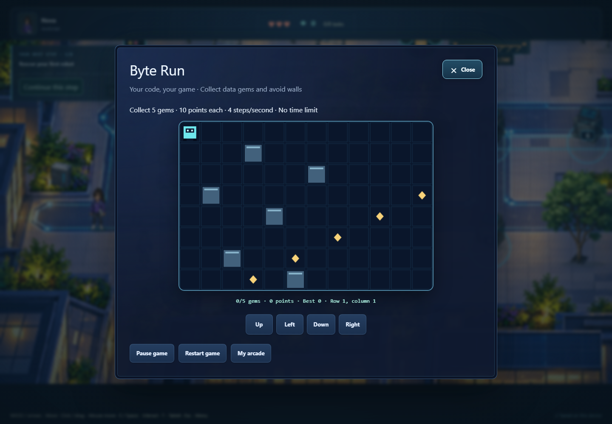</a><br><sub><b>Play a game you created</b><br>change the rules in code, save your design and beat it</sub></td>
<td align="center" width="50%"><a href="https://codequest-game-inky.vercel.app/">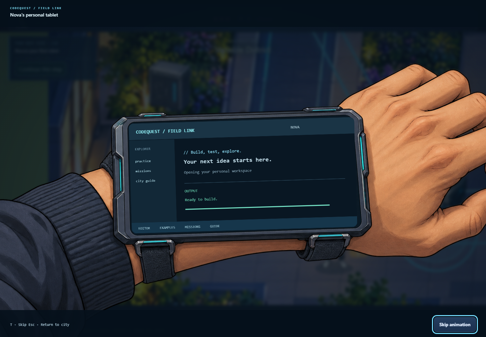</a><br><sub><b>Raise your wrist tablet</b><br>an illustrated 2D opening connects the city to your editor</sub></td>
</tr>
</table>

<sub><a href="https://codequest-game-inky.vercel.app/">Play the live game</a> &nbsp;|&nbsp; <a href="https://github.com/amirh3sam/codequest-game">Browse the source</a></sub>

**[PDF Studio](https://freeonlinepdfeditor.vercel.app/)** &nbsp;|&nbsp; <sub>a free, private PDF toolkit: merge, split, compress, convert, edit, sign and fill forms. 12 tools that run entirely in the browser, backed by 60 automated end-to-end tests</sub>

<table align="center" width="100%">
<tr>
<td align="center" colspan="2"><a href="https://freeonlinepdfeditor.vercel.app/"></a><br><sub><b>Every PDF tool in one place</b><br>pick a tool, drop a file, download the result. Nothing is uploaded</sub></td>
</tr>
<tr>
<td align="center" width="50%"><a href="https://freeonlinepdfeditor.vercel.app/#edit"></a><br><sub><b>Edit, fill and sign</b><br>change existing text, fill form fields, add notes, arrows and signatures</sub></td>
<td align="center" width="50%"><a href="https://freeonlinepdfeditor.vercel.app/#watermark">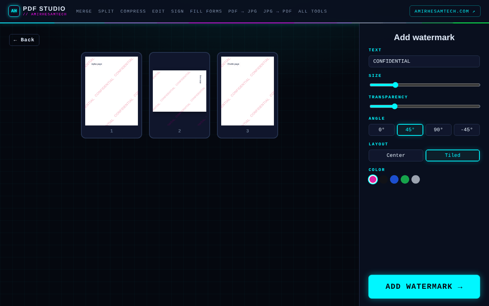</a><br><sub><b>Watermark with live preview</b><br>center or tiled, any angle, colour and transparency</sub></td>
</tr>
<tr>
<td align="center" width="50%"><a href="https://freeonlinepdfeditor.vercel.app/#compress"></a><br><sub><b>Compress, split, merge, convert</b><br>three compression levels, ranges, zips, JPG and PDF</sub></td>
<td align="center" width="50%"><a href="https://freeonlinepdfeditor.vercel.app/">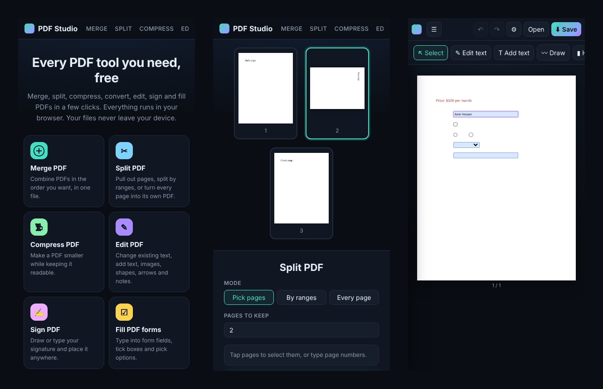</a><br><sub><b>Works on phones</b><br>same tools, touch-friendly layout</sub></td>
</tr>
<tr>
<td align="center" colspan="2"><a href="https://github.com/amirh3sam/FreeonlinePDFeditor/tree/main/tests">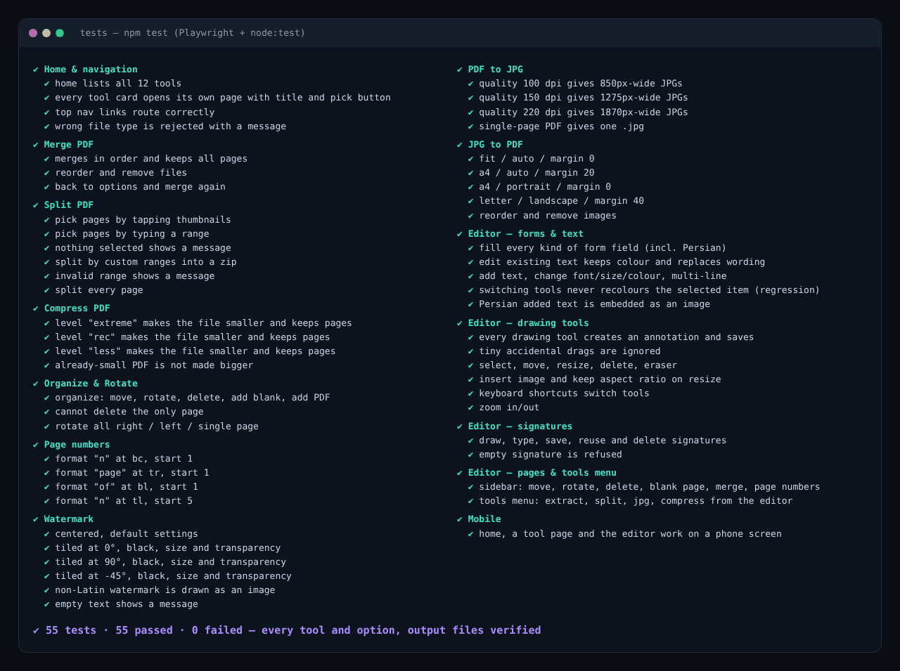</a><br><sub><b>60 end-to-end tests, all green</b><br>Playwright + node:test open every downloaded file and check pages, rotation, text, images and zips, on every push</sub></td>
</tr>
</table>

<sub><a href="https://freeonlinepdfeditor.vercel.app/">Try it live</a> &nbsp;|&nbsp; <a href="https://github.com/amirh3sam/FreeonlinePDFeditor">Browse the source</a> &nbsp;|&nbsp; <a href="https://github.com/amirh3sam/FreeonlinePDFeditor/tree/main/tests">See the tests</a></sub>

**[Resistor Calculator](https://resistor-calculator-lemon.vercel.app)** &nbsp;|&nbsp; <sub>resistor colour codes both ways, SMD codes, LED resistors and series/parallel in one phone app. Installs to your home screen, works offline and remembers where you left off</sub>

<table align="center">
<tr>
<td align="center" width="25%"><a href="https://resistor-calculator-lemon.vercel.app">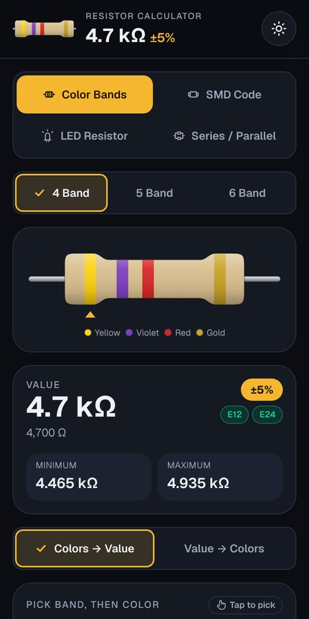</a><br><sub><b>Colour Bands</b><br>tap the bands or type a value</sub></td>
<td align="center" width="25%"><a href="https://resistor-calculator-lemon.vercel.app">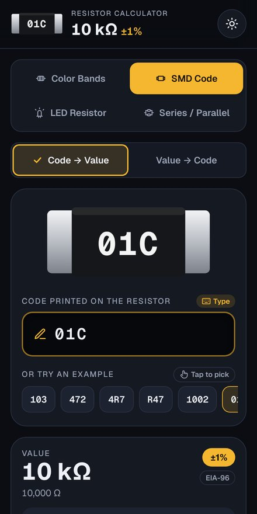</a><br><sub><b>SMD Code</b><br>3-digit, 4-digit, R and EIA-96</sub></td>
<td align="center" width="25%"><a href="https://resistor-calculator-lemon.vercel.app">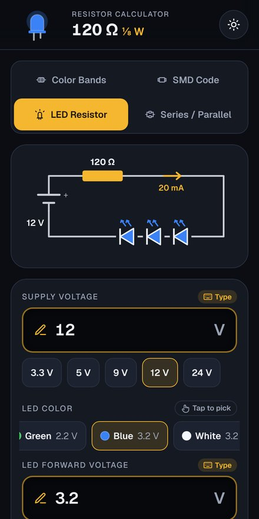</a><br><sub><b>LED Resistor</b><br>the right resistor and wattage</sub></td>
<td align="center" width="25%"><a href="https://resistor-calculator-lemon.vercel.app">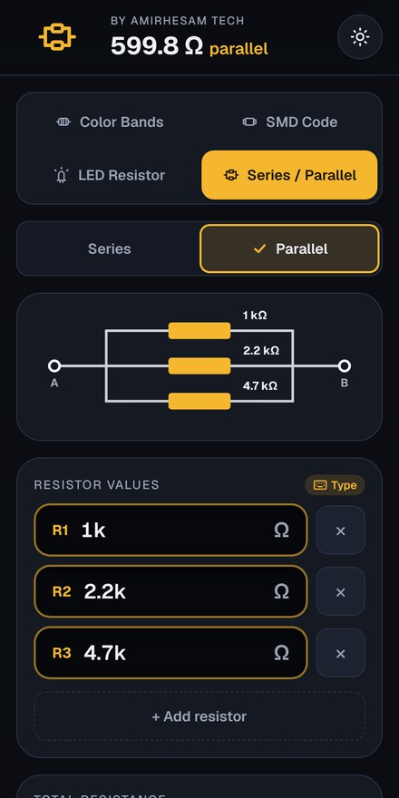</a><br><sub><b>Series / Parallel</b><br>combine or find a pair</sub></td>
</tr>
</table>

<sub><a href="https://resistor-calculator-lemon.vercel.app">Open the app</a> &nbsp;|&nbsp; <a href="https://github.com/amirh3sam/ResistorChart">Browse the source</a></sub>


## `> TECH_ARSENAL`

<div align="center">

     

</div>

| | |
|:--|:--|
| `LANGUAGES` | Java · SQL · JavaScript · HTML5 · CSS3 |
| `WEB` | React · Node.js |
| `AUTOMATION` | Selenium · Cucumber BDD · JUnit 5 · TestNG · Serenity · Maven · Apache POI |
| `API` | REST Assured · Postman |
| `DATA` | MySQL · Oracle · JDBC |
| `CI / CD` | Jenkins · Azure DevOps · Docker · Git · TFVC |
| `CLOUD` | AWS · Azure · Cloudflare · Raspberry Pi |
| `TOOLS` | IntelliJ IDEA · Eclipse · VS Code · Jira |
| `VISUAL` | Photoshop · Lightroom · GIMP · Corel |


## `> SYSTEM_ANALYTICS.exe`

<div align="center">

<!--COMMIT-COUNT:START-->


<!--COMMIT-COUNT:END-->


</div>


## `> PERSONAL_MODULES`

```text
[ MUSIC MODULE ]       ██████████ ONLINE  🎸
[ GAMING MODULE ]      ██████████ ONLINE  🎮
[ PHOTOGRAPHY ]        ██████████ ONLINE  📸
[ AUTOMATION ]         ██████████ ONLINE  ⚙️
[ APP & WEB BUILDER ]  ██████████ ONLINE  🌐
[ LEARNING ]           ██████████ ACTIVE  🧠
```

## `> RANDOM_TRANSMISSION`

<div align="center">


</div>


## `> OPEN_COMM_CHANNEL`

<div align="center">

[](https://amirhesamtech.com) [](https://github.com/amirh3sam) [](https://www.tiktok.com/@techwithamirh3sam)

</div>

<p align="center">
  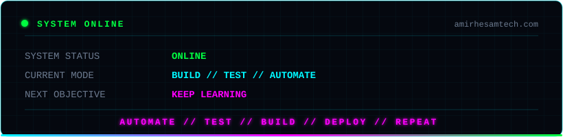
</p>
